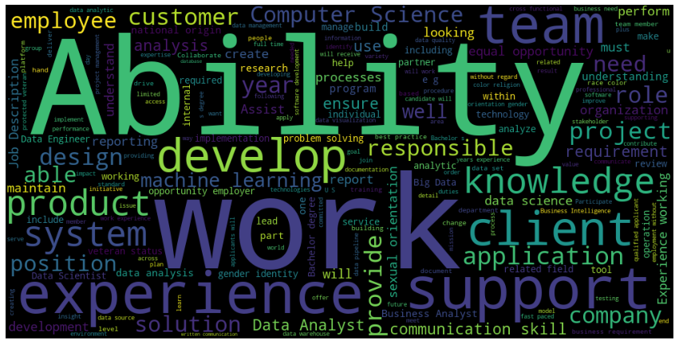

# Data-related-salaries
The objective is to do EDA on data related job postings (USA). Later we can try to predict a salary using job posting information.

Words used in job postings.

# Why?
When applying for a data related job (Data scientist, Data Analyst...), it can be hard to forget how well some companies can pay for your time. Of course, as a mathematical person, the compensations can be a deciding factor between two otherwise similar jobs.

# TODO:

- [x] Read the data and clean it
- [x] Perform EDA.
    - We do this to get a clearer picture of the dataset.
    - [ ] Re-do with new data and add section about the data given title
- [ ] Create a prediction/classifier model that can predict the salary/salary range when given information about the job.

- [ ] ~~Dockerize and deploy, so that anyone can use the tool
    - The point of the whole tool is to help you understand what different positions are paying, which can then be leveraged in the interviews for your own benefit. Do not let employers lowball you!~~
